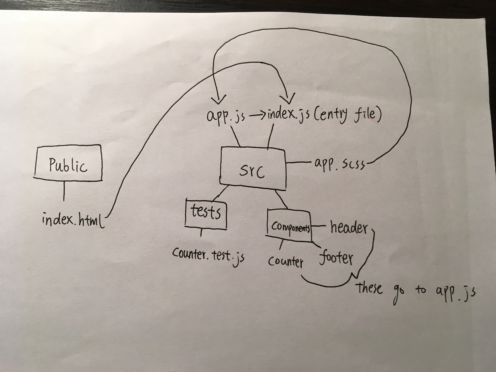

# LAB - 27

## React Testing and Deployment 

### Author: David Zheng 

### Links and Resources
* [submission PR](https://github.com/davidzheng-401d32/lab-27/pull/2)

* [travis](https://travis-ci.com/davidzheng-401d32/lab-27/builds/137320440)

* [aws s3](http://davidlab27.s3-website-us-west-2.amazonaws.com/)
* [aws amplify](https://master.d3fq8oa4iogvdq.amplifyapp.com/)
* [netlify](https://cocky-chandrasekhar-0d7704.netlify.com/)

#### Running the app
* `npm start`

  
#### Tests
`unit testing`: npm test

`lint testing`: npm run lint 

#### UML

